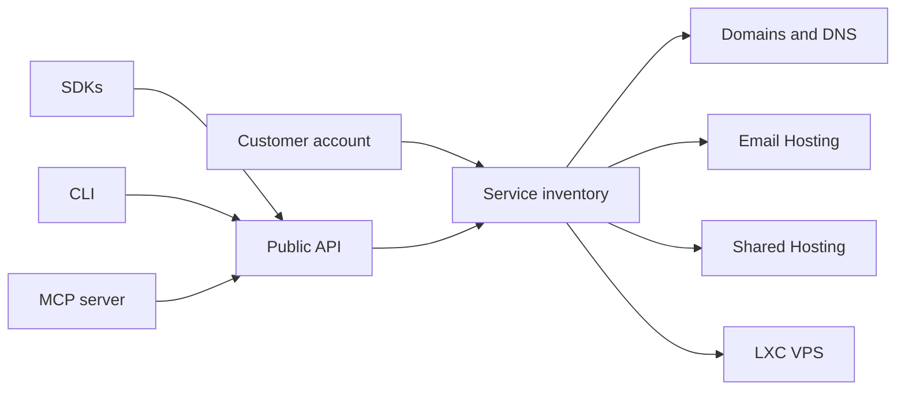

## Service model

An authenticated KmerHosting account owns a service inventory. Each service has a type, status, plan or product context, renewal information, and a management mode. Product systems own their specialized data; the central inventory gives the console and public API one customer-facing view.

## Public integration boundary

The API gateway authenticates an account-scoped API key or an OAuth access token, verifies the required scope, then routes supported work to the owning product system. It returns a stable envelope and request ID. Product provider credentials and internal database records are never returned through this boundary.

Writes use idempotency keys. Some product operations are queued: acceptance means the request was recorded for processing, not that an external provider has completed it immediately.

## Pricing and availability

Catalogs are live product data. Documentation does not copy fixed prices or availability because they can change. Shared Hosting currently supports 1-, 3-, 6-, and 12-month billing periods; its catalog determines the applicable plan, panel, support level, price, and availability at checkout or renewal time.
